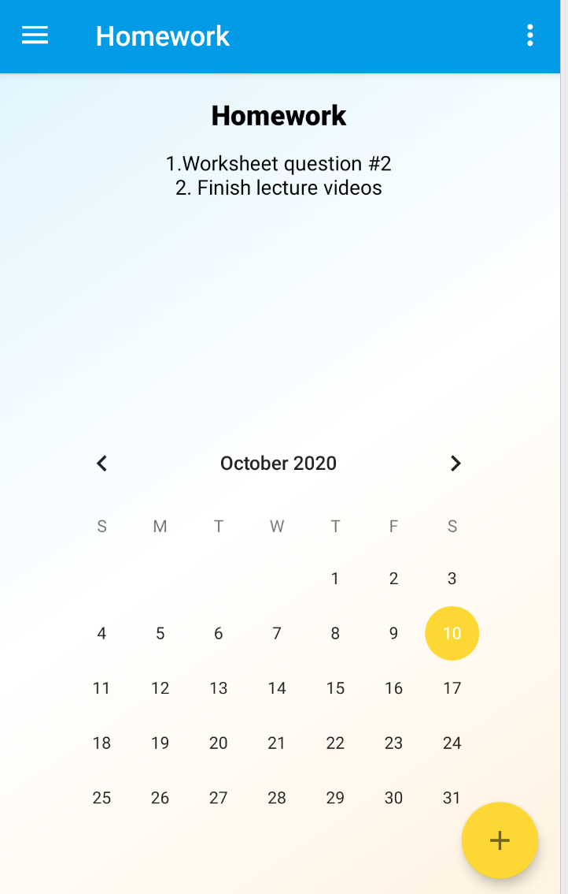
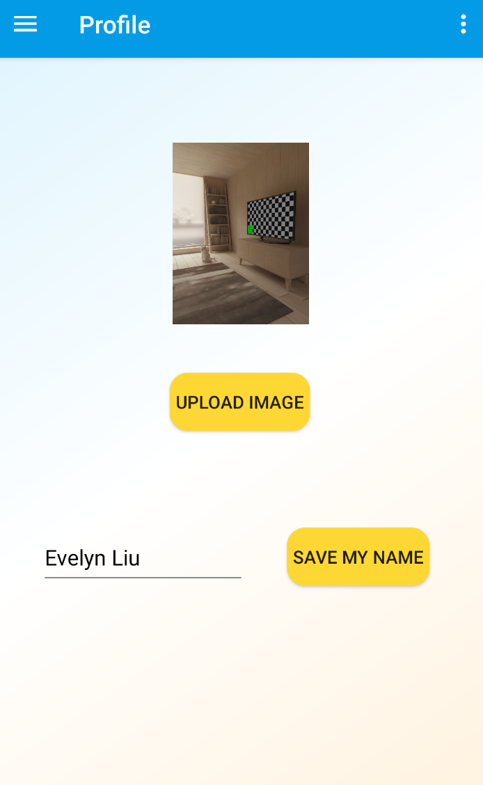

from IPython.display import HTML, display

# EClass
**EClass is an Android app that can be used by instructors and students to communicate with each other to gain a better learning experience. The app supports features such as checking assignments, asking and answering questions, and watching recordings posted by instructors. Instructors have access to posting videos and assignments.**

**Video demo link: https://www.youtube.com/playlist?list=PLzdO1sIaZSXu25Sux3l0v1k3fn5DgKrRp**

## Sign in / Register
Phone number is required for first-time registration and same phone number needs to be used for sign in. Log out button located in both navigation and menu bar.  
 

## Homework
Students can view homework assignments on different date and instructors have access to post homework
 

## Question
Users can view, answer, and post questions that are accessible to all users. Questions and answers can be posted anonymouly.
 
  

## Recording
Instructors can watch the videos and instructors are given the access to post videos.
 
 

## Profile
Changes to name and profile picture can be made here.
 
 
